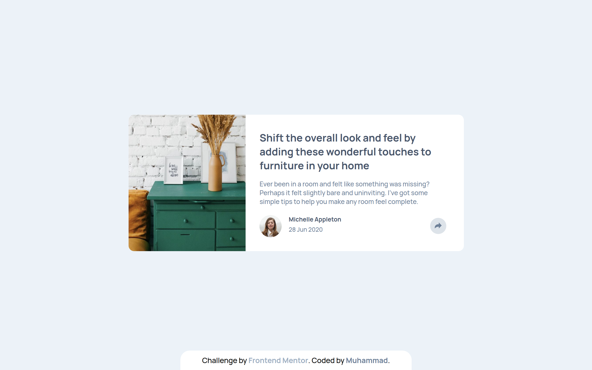
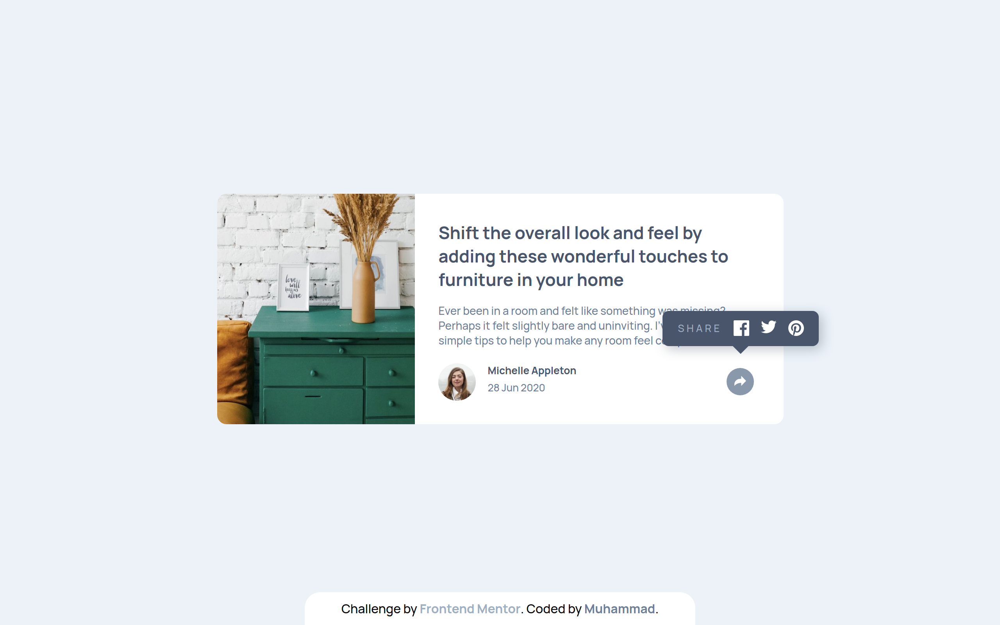
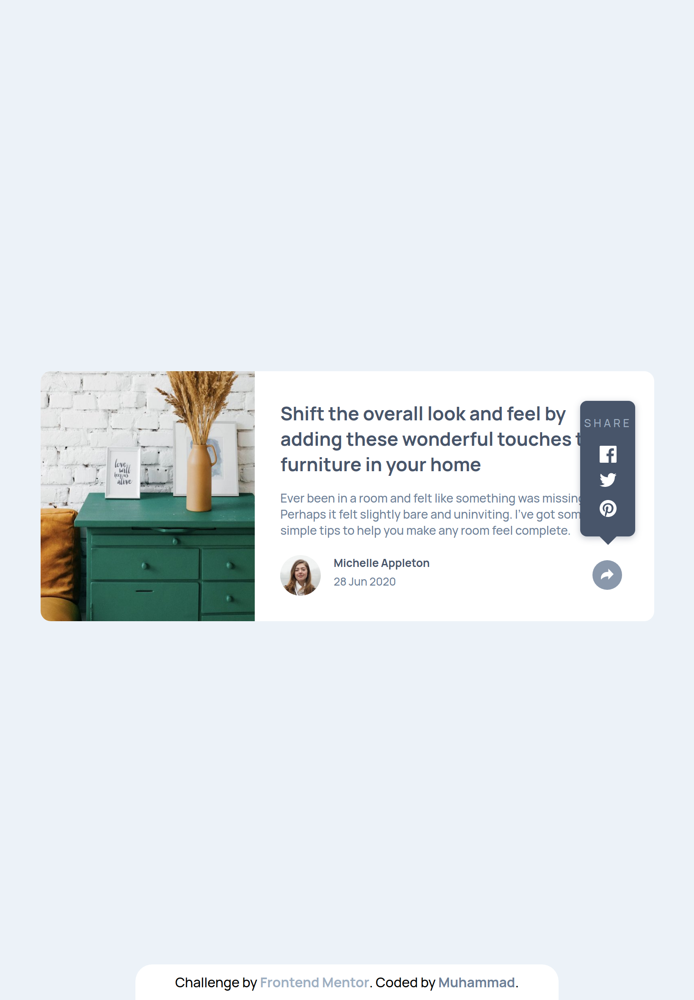
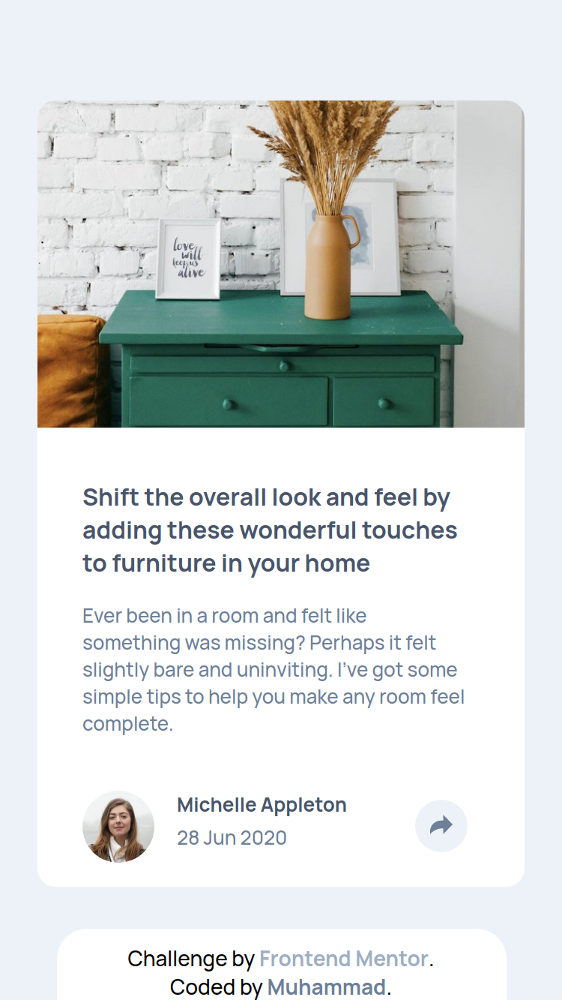
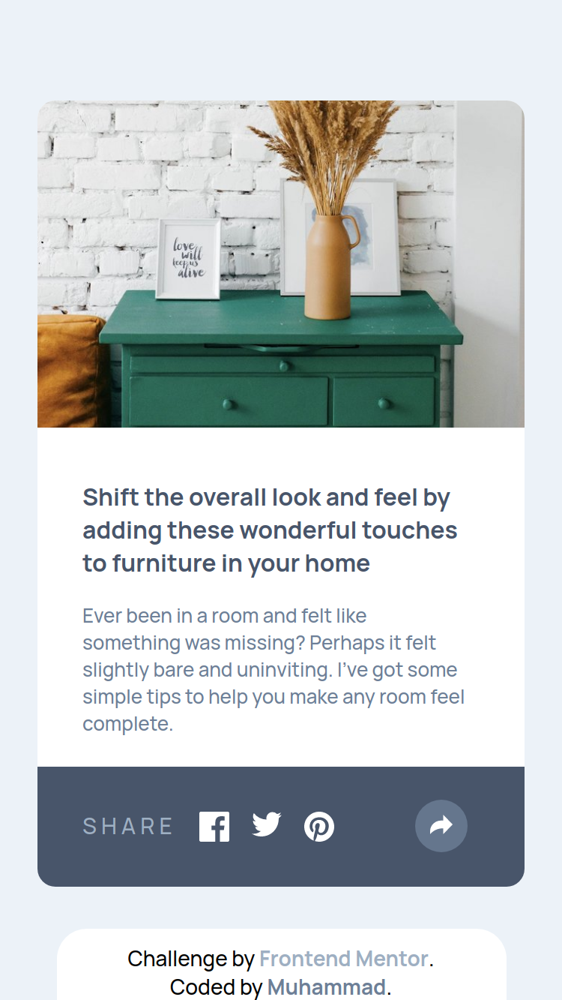

# Frontend Mentor - Article preview component solution

This is a solution to the [Article preview component challenge on Frontend Mentor](https://www.frontendmentor.io/challenges/article-preview-component-dYBN_pYFT). Frontend Mentor challenges help you improve your coding skills by building realistic projects.

## Screenshots 🎉

## Links

- Live Site Url: [Demo](https://muhammad-abdusalam.github.io/Article-preview-component/)
- Solution Url: [Solution](https://www.frontendmentor.io/solutions/article-preview-component-YFd30iu68U)

## Built with 🔨️

- Semantic HTML5 markup
- CSS FlexBox
- SASS
- JS

## Author

- Frontend Mentor - [@Muhammad-adam778](https://www.frontendmentor.io/profile/Muhammad-adam778)
- Linkedin - [@muhammad-abdusalam](https://www.linkedin.com/in/muhammad-abdusalam)
